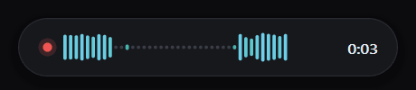

# deepgram-dictation

[](https://github.com/rawasmhd/deepgram-dictation/actions/workflows/ci.yml)

Minimal push-to-talk dictation for Windows. Press **Alt+M**, speak, press **Alt+M** again, and the transcribed text is pasted at your cursor, in any app. On screen there is only a small level meter that floats above the taskbar while you talk, and an icon in the notification area.

Audio goes to [Deepgram](https://deepgram.com) for transcription. The app stores no audio.

<p align="center">
  
</p>

## Features

- **Alt+M** to start, **Alt+M** to stop and paste
- **Ctrl+Alt+Z** to delete the last dictation (if you have not typed since)
- **Ctrl+Alt+Q** to quit
- Works in any application: the text goes wherever your cursor is
- **Live paste**: each phrase appears while you speak, so all the text is in place the moment you stop
- Floating microphone meter while recording, and a "Transcribing" animation while it works
- A tray icon that shows the state (recording, transcribing, a problem), with a menu for the settings, start at login, the log file and quit
- Follows the Windows light or dark mode
- Keeps your dictation on the clipboard, so nothing is lost if no text box had focus
- Smart formatting and spoken punctuation ("comma", "new paragraph") with Deepgram's `nova-3`
- **One small file**: `dictation.exe` is about 1 MB, needs no Python or other runtime, and uses about 15 MB of memory

## Install

1. Get a Deepgram API key at [console.deepgram.com](https://console.deepgram.com), under **API Keys**. New accounts get free credit.
2. Download `dictation.exe` from the [latest release](https://github.com/rawasmhd/deepgram-dictation/releases/latest).
3. Put it in a folder that you keep, for example `%LOCALAPPDATA%\DeepgramDictation`. The app saves its settings (`.env`) and its log (`dictation.log`) next to the `.exe`.
4. Double-click `dictation.exe`. A setup window opens:
   - Paste your API key. The app checks it with Deepgram before it saves it.
   - Keep **Start when I sign in to Windows** on, if you want it at every login.
   - Select **Save**.

That's it. Press **Alt+M** anywhere to dictate.

## Windows security prompts

`dictation.exe` is not code-signed yet. Code signing is being set up with [SignPath Foundation](https://signpath.org), which provides free code signing for open-source projects (see the [code signing policy](CODE_SIGNING.md) and [#19](https://github.com/rawasmhd/deepgram-dictation/issues/19)). Until then, Windows may warn you the first time:

- **"Windows protected your PC"** (SmartScreen): select **More info → Run anyway**.
- **"Smart App Control blocked an app"**: while Smart App Control is on, Windows does not run unsigned apps, and there is no way past it. The app can run on such a PC only after it is signed.
- **Antivirus warnings**: the app registers global hotkeys, simulates Ctrl+V and Backspace, and uses a keyboard hook that only notices *that* you typed (to cancel undo). Some scanners find this suspicious. The full source code is in [`rust/src`](rust/src).

## Usage

1. Put your cursor where you want the text.
2. Press **Alt+M**. The meter appears above your taskbar.
3. Speak. Each phrase is pasted as soon as Deepgram finishes it.
4. Press **Alt+M** again. The rest of the text is pasted, and all of it is on the clipboard.

More:

- Taps shorter than 0.4 s are ignored, so a stray press does not send an empty request.
- Live paste writes only into the window that had focus when you started. If you switch to another window, the meter shows **Paused**, and the text waits until you come back. If you stop in another window after some text was pasted, the rest goes only to the clipboard. If no text was pasted yet, all of it goes into the window that has focus when you stop.
- **Ctrl+Alt+Z** deletes the last dictation with Backspace. It works only in the same window and if you have not typed since. A mouse click does not cancel it, so do not click somewhere else in the text first.
- To start the app again after Ctrl+Alt+Q, double-click `dictation.exe`.
- To change the API key or the start at login, select the tray icon, then **Settings…**. You can also run `dictation.exe --setup`.
- The tray menu can also start and stop a dictation. The text goes into the window you used last.

## Settings

Two environment variables change how it transcribes:

| Variable | Default | Effect |
|---|---|---|
| `DICTATION_MODE` | streaming | `batch` uploads the recording after you stop. This is simpler, but the wait grows with how long you spoke. |
| `DICTATION_LIVE_PASTE` | on | `0` pastes all the text when you stop, not phrase by phrase. |

### Custom words

Deepgram can spell names, product names and other rare words wrong. To fix this, make a file `words.txt` next to `dictation.exe`, with one word or phrase on each line:

```
# lines that start with # are ignored
Rawas
GitHub Actions
Dr. Smith
```

- Write each term the way you want to see it. Deepgram keeps the case, for example `GitHub`.
- The app reads the file at the start of each dictation, so you do not need to restart it.
- Add only words that Deepgram gets wrong. 20 to 50 terms work best.
- Deepgram allows about 500 tokens of custom words. If the list is too long, the app tells you once and dictates without the list until you change the file.
- Custom words cost extra: Deepgram adds $0.0013 per minute. With no `words.txt`, the app sends no custom words.

More detail: [docs/keyterm-prompting.md](docs/keyterm-prompting.md).

The language (`en`) and the model (`nova-3`) are set in [`rust/src/deepgram.rs`](rust/src/deepgram.rs). To dictate in another language, change `"language"` there and build the app again (see [Deepgram's language list](https://developers.deepgram.com/docs/models-languages-overview)).

## Upgrading from the Python version

Earlier versions were a Python script (`dictate.py`) with `setup.bat`. To move to `dictation.exe`:

1. Quit the Python version with **Ctrl+Alt+Q**. Only one version can run at a time.
2. Copy your `.env` file next to `dictation.exe`, so you do not need to enter the key again. Or run `dictation.exe --setup` and paste the key.
3. In the setup, select **Start automatically when I log in**. This also removes the Python version's Startup shortcut.

The Python version is still in the Git history, in the commits before #23.

## Uninstall

1. Run `dictation.exe --setup`, clear **Start automatically when I log in**, and select **Save**. (Or remove the `DeepgramDictation` entry from Task Manager → **Startup apps**.)
2. Quit with **Ctrl+Alt+Q**.
3. Delete the folder with `dictation.exe`, `.env` and `dictation.log`.

## Troubleshooting

**Nothing happens on Alt+M.** Check in Task Manager that `dictation.exe` runs. If not, double-click it. Errors are in `dictation.log` next to the `.exe`.

**"Alt+M, Ctrl+Alt+Z or Ctrl+Alt+Q is already used by another app".** Another program registered the same hotkey. Quit it, then start the app again.

**Alt+M no longer works in Word or Excel.** While the app runs, it captures Alt+M, so other apps do not get it (Word uses it for the Mailings tab, Excel for the Formulas tab).

**"Key rejected - check your API key".** The key is wrong or expired. Run `dictation.exe --setup` and paste a new key.

**"No connection to Deepgram".** Check your internet connection.

**"Microphone unavailable".** Another app may hold the microphone, or Windows does not allow microphone access (Settings → Privacy & security → Microphone).

**Text goes to the wrong place.** The text goes to the window that has focus. Click into the target field before you press Alt+M.

## How it works

`dictation.exe` is a small Rust program ([`rust/`](rust)). It registers its hotkeys with Windows (`RegisterHotKey`) and runs without a console window.

On the first Alt+M, it opens the microphone, converts the audio to 16 kHz mono, and streams it to Deepgram over a WebSocket while you talk. Each final phrase is pasted at once (live paste): the app puts it on the clipboard and simulates Ctrl+V. When you press Alt+M again, it waits only for the last phrase. If the stream returns no text, the app uploads the whole recording instead (batch).

The meter is a layered, click-through window. It never takes the focus and never intercepts a click.

## Build from source

See [rust/README.md](rust/README.md). In short, with [Rust](https://rustup.rs) installed:

```bash
cd rust
cargo build --release
```

The benchmark that compares versions is in [`bench/`](bench).

## Privacy and code signing

- [Privacy policy](PRIVACY.md): the app sends your microphone audio to Deepgram only while you record, and nothing else.
- [Code signing policy](CODE_SIGNING.md): how releases are built and signed.

## Contributing

Contributions are welcome. See [CONTRIBUTING.md](.github/CONTRIBUTING.md). **macOS support** is the most-wanted addition ([#1](https://github.com/rawasmhd/deepgram-dictation/issues/1)).

## License

MIT. See [LICENSE](LICENSE).
